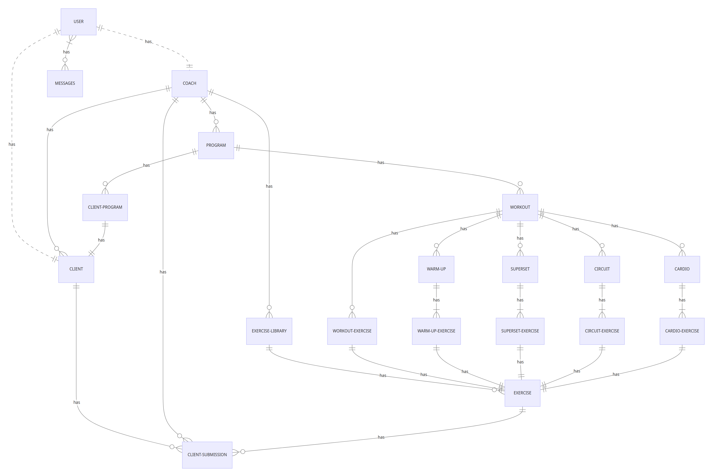

# Design Document

By Joshua Ramirez

## Video Link
[Link to the Google Clone App Video](https://youtu.be/wQTS7ydQHmE)

# Initializing the SQLite Database
1. sqlite3 coaching.db
2. .read schema.sql
3. .read queries.sql

## Scope

The purpose of this database is to manage a fitness and coaching platform. It will facilitate the relationship between coaches and clients, allow clients to participate in fitness programs, log workouts, and track their progress. Coaches can create exercise libraries, design programs, and provide feedback to clients.

Entities In Scope:

* User: Includes both clients and coaches. This encompasses individuals who are part of the fitness platform.
* Client: Represents clients who participate in fitness programs and workouts.
* Coach: Represents fitness coaches who create programs, workouts, and provide guidance to clients.
* ExerciseLibrary: Includes exercise libraries created by coaches.
* Exercise: Represents individual exercises categorized by type (e.g., Strength, Cardio).
* Program: Represents fitness programs designed by coaches.
* ClientProgram: Associates clients with specific fitness programs.
* Workout: Represents individual workout sessions within a program.
* ClientSubmission: Contains records of client workout submissions.
* WarmUp, Supersets, Circuits, Cardio: Entities to store various workout components with exercises.

Entities Outside of Scope:

* Financial transactions or payment information.
Social interactions and messaging between users (chat functionality).
* User preferences and settings (notification preferences, profile settings).
* Dietary information and nutrition tracking.

## Functional Requirements

User Interactions:

* A user (coach or client) can register and log into the platform.
* Coaches can create exercise libraries, exercises, and fitness programs.
* Clients can enroll in fitness programs created by coaches.
* Clients can view and log individual workout sessions.
* Clients can submit workout results.
* Coaches can review and provide feedback on client workout submissions.
* Users can search for workouts and exercises.

Beyond the Scope:

* The platform does not handle financial transactions.
* It does not provide social interaction features.
* It does not manage dietary or nutrition tracking.
Representation

## Representation

### Entities

#### User

The `User` table includes:

* `id`, which specifies the unique ID for the user as an `INTEGER`. This column has the `PRIMARY` KEY constraint applied.
* `first_name`, which specifies the user's first name as `VARCHAR(50) NOT NULL`, as a textual field for the first name.
* `last_name`, which specifies the user's last name as `VARCHAR(50) NOT NULL`, as a textual field for the last name.
* `email`, which specifies the user's email address as `VARCHAR(100) NOT NULL UNIQUE`, ensuring uniqueness for each email address.
* `password_hash`, which stores the hashed password as `CHAR(60) NOT NULL`.
* `password_salt`, which stores the salt for password hashing as `CHAR(16) NOT NULL`.
* `date_of_birth`, which specifies the user's date of birth as `DATE NOT NULL`.
* `user_type`, which specifies the type of user as `TEXT NOT NULL`, with a `CHECK` constraint ensuring it's either 'Coach' or 'Client'.

#### Coach

The `Coach` table includes:

* `id`, which specifies the unique ID for the coach as an `INTEGER`. This column has the `PRIMARY KEY` constraint applied.
* `user_id`, which references the associated user's ID in the `User` table via a `FOREIGN KEY` constraint.

#### Client

The `Client` table includes:

* `id`, which specifies the unique ID for the client as an `INTEGER`. This column has the `PRIMARY KEY` constraint applied.
* `user_id`, which references the associated user's ID in the `User` table via a `FOREIGN KEY` constraint.
* `coach_id`, which references the associated coach's ID in the `Coach` table via a `FOREIGN KEY` constraint.

#### Messages

The `Messages` table includes:

* `message_id`, which specifies the unique ID for the message as an `INTEGER`. This column has the `PRIMARY KEY` constraint applied.
* `sender_id`, which references the sender's user ID in the `User` table via a `FOREIGN KEY` constraint.
* `receiver_id`, which references the receiver's user ID in the `User` table via a `FOREIGN KEY` constraint.
* `message_text`, which stores the content of the message as `TEXT`.
* `timestamp`, which specifies the timestamp of the message as `TIMESTAMP`.

#### ExerciseLibrary

The `ExerciseLibrary` table includes:

* `id`, which specifies the unique ID for the exercise library as an `INTEGER`. This column has the `PRIMARY KEY` constraint applied.
* `coach_id`, which references the coach who owns the library via a `FOREIGN KEY` constraint.

#### Exercise

The `Exercise` table includes:

* `id`, which specifies the unique ID for the exercise as an `INTEGER`. This column has the `PRIMARY KEY` constraint applied.
* `name`, which specifies the exercise name as `VARCHAR(50) NOT NULL`.
* `category`, which specifies the exercise category as `VARCHAR(50)`.
* `video_link`, which stores the link to the exercise video as `VARCHAR(255)`.
* `description`, which stores the exercise description as `TEXT`.
* `exercise_library_id`, which references the exercise library that contains the exercise via a `FOREIGN KEY` constraint.

#### Program

The `Program` table includes:

* `id`, which specifies the unique ID for the program as an `INTEGER`. This column has the `PRIMARY KEY` constraint applied.
* `program_name`, which specifies the program name as `VARCHAR(50) NOT NULL`.
* `description`, which stores the program description as `TEXT`.
* `duration`, which specifies the program's duration in days or weeks as an `INT`.
* `coach_id`, which references the coach who created the program via a `FOREIGN KEY` constraint.

#### ClientProgram

The `ClientProgram` table includes:

* `client_id`, which references the client enrolled in the program via a `FOREIGN KEY` constraint.
* `program_id`, which references the program in which the client is enrolled via a `FOREIGN KEY` constraint.
Workout

#### The Workout table includes:

The `Workout` table includes:

* `id`, which specifies the unique ID for the workout as an `INTEGER`. This column has the `PRIMARY KEY` constraint applied.
* `workout_name`, which specifies the workout name as `VARCHAR(50) NOT NULL`.
* `description`, which stores the workout description as `TEXT`.
* `program_id`, which references the program to which the workout belongs via a `FOREIGN KEY` constraint.

#### WorkoutExercise

The `WorkoutExercise` table includes:

* `id`, which specifies the unique ID for the workout exercise as an `INTEGER`. This column has the `PRIMARY KEY` constraint applied.
* `exercise_order`, which specifies the order of the exercise within the workout.
* `reps`, which specifies the number of repetitions for the exercise.
* `sets`, which specifies the number of sets for the exercise.
* `tempo`, which specifies the exercise tempo as `VARCHAR(30)`.
* `rest`, which specifies the rest duration in seconds.
* `instructions`, which stores any specific instructions for the exercise.
* `exercise_id`, which references the exercise used in the workout via a `FOREIGN KEY` constraint.
* `workout_id`, which references the workout in which the exercise is included via a `FOREIGN KEY` constraint.

#### WarmUp

The `WarmUp` table includes:

* `id`, which specifies the unique ID for the warm-up routine as an `INTEGER`. This column has the `PRIMARY KEY` constraint applied.
* `name`, which specifies the name of the warm-up routine as `VARCHAR(50)`.
* `instructions`, which stores instructions for the warm-up as `TEXT`.
* `workout_id`, which references the workout to which the warm-up belongs via a `FOREIGN KEY` constraint.

#### WarmUpExercise

The `WarmUpExercise` table includes:

* `exercise_order`, which specifies the order of exercises within the warm-up routine.
* `reps`, which specifies the number of repetitions for each exercise in the warm-up.
* `sets`, which specifies the number of sets for each exercise in the warm-up.
* `tempo`, which specifies the exercise tempo for each exercise in the warm-up as `VARCHAR(30)`.
* `rest`, which specifies the rest duration in seconds between exercises in the warm-up.
* `instructions`, which stores specific instructions for each exercise in the warm-up as `TEXT`.
* `warm_up_id`, which references the warm-up routine via a `FOREIGN KEY` constraint.
* `exercise_id`, which references the exercise used in the warm-up via a `FOREIGN KEY` constraint.

#### Supersets

The `Supersets` table includes:

* `id`, which specifies the unique ID for the superset as an `INTEGER`. This column has the `PRIMARY KEY` constraint applied.
* `name`, which specifies the name of the superset as `VARCHAR(50)`.
* `instructions`, which stores instructions for the superset as `TEXT`.
* `workout_id`, which references the workout to which the superset belongs via a `FOREIGN KEY` constraint.

#### SupersetExercises

The `SupersetExercises` table includes:

* `exercise_order`, which specifies the order of exercises within the superset.
* `reps`, which specifies the number of repetitions for each exercise in the superset.
* `sets`, which specifies the number of sets for each exercise in the superset.
* `tempo`, which specifies the exercise tempo for each exercise in the superset as `VARCHAR(30)`.
* `rest`, which specifies the rest duration in seconds between exercises in the superset.
* `instructions`, which stores specific instructions for each exercise in the superset as `TEXT`.
* `superset_id`, which references the superset via a `FOREIGN KEY` constraint.
* `exercise_id`, which references the exercise used in the superset via a `FOREIGN KEY` constraint.

#### Circuits

The `Circuits` table includes:

* `id`, which specifies the unique ID for the circuit as an `INTEGER`. This column has the `PRIMARY KEY` constraint applied.
* `name`, which specifies the name of the circuit as `VARCHAR(50)`.
* `instructions`, which stores instructions for the circuit as `TEXT`.
* `workout_id`, which references the workout to which the circuit belongs via a `FOREIGN KEY` constraint.

#### CircuitExercises

The `CircuitExercises` table includes:

* `exercise_order`, which specifies the order of exercises within the circuit.
* `reps`, which specifies the number of repetitions for each exercise in the circuit.
* `sets`, which specifies the number of sets for each exercise in the circuit.
* `tempo`, which specifies the exercise tempo for each exercise in the circuit as `VARCHAR(30)`.
* `rest`, which specifies the rest duration in seconds between exercises in the circuit.
* `instructions`, which stores specific instructions for each exercise in the circuit as `TEXT`.
* `circuit_id`, which references the circuit via a `FOREIGN KEY` constraint.
* `exercise_id`, which references the exercise used in the circuit via a `FOREIGN KEY` constraint.

#### Cardio

The `Cardio` table includes:

* `id`, which specifies the unique ID for the cardio routine as an `INTEGER`. This column has the `PRIMARY KEY` constraint applied.
* `name`, which specifies the name of the cardio routine as `VARCHAR(50)`.
* `instructions`, which stores instructions for the cardio routine as TEXT.
* `workout_id`, which references the workout to which the cardio routine belongs via a `FOREIGN KEY` constraint.

#### CardioExercises

The `CardioExercises` table includes:

* `exercise_order`, which specifies the order of exercises within the cardio routine.
* `reps`, which specifies the number of repetitions for each exercise in the cardio routine.
* `sets`, which specifies the number of sets for each exercise in the cardio routine.
* `tempo`, which specifies the exercise tempo for each exercise in the cardio routine as `VARCHAR(30)`.
* `rest`, which specifies the rest duration in seconds between exercises in the cardio routine.
* `instructions`, which stores specific instructions for each exercise in the cardio routine as `TEXT`.
* `cardio_id`, which references the cardio routine via a `FOREIGN KEY` constraint.
* `exercise_id`, which references the exercise used in the cardio routine via a `FOREIGN KEY` constraint.

#### ClientSubmissions

The `ClientSubmissions` table includes:

* `id`, which specifies the unique ID for the submission as an `INTEGER`. This column has the `PRIMARY KEY` constraint applied.
* `notes`, which stores submission notes as `TEXT`.
* `data_url`, which specifies the URL to stored photos or videos related to the submission as `VARCHAR(255)`.
* `submission_date`, which specifies the timestamp of the submission as `TIMESTAMP`.
* `coach_response`, which stores the coach's response as `TEXT`.
* `client_id`, which references the client who made the submission via a `FOREIGN KEY` constraint.
* `coach_id`, which references the coach who reviewed the submission via a `FOREIGN KEY` constraint.
* `exercise_id`, which references the exercise related to the submission via a `FOREIGN KEY` constraint.

### Relationships

The below entity relationship diagram describes the relationships among the entities in the database.

As detailed by the diagram:

* Each `User` entity can have one of two roles, `Coach` or `Client`.
* `Users` can communicate with each other through messages. Specifically, `Coach` and `Client` users can exchange messages.
* Each `Coach` has their own single `ExerciseLibrary`.
* Multiple `Exercise` entities can be created and saved with general information.
* Many `Exercise` entities can be saved within the `ExerciseLibrary`.
* `Coach` users can create multiple `Programs`.
* A `Program` can contain multiple `Workouts`.
* A `Workout` can have 0 to many associated `WorkoutExercise`, `WarmUp`, `Supersets`, `Circuits`, and `Cardio` entities.
* `WorkoutExercise` entities are comprised of a single `Exercise` and additional information that can vary per `Workout`.
* `WarmUp` entities consist of one to many `WarmUpExercise` entities, along with additional information that can vary per `Workout`.
* `Supersets` entities are composed of one to many `SupersetExercises` entities, along with additional information that can vary per `Workout`.
* `Circuits` entities are constructed from one to many `CircuitExercises` entities, along with additional information that can vary per `Workout`.
* `Cardio` entities are comprised of one to many `CardioExercises` entities, along with additional information that can vary per `Workout`.
* For all `Exercise`, `Client` entities can submit 0 to many notes, photos, and videos through `ClientSubmissions`, which can be accessed by the coach.

## Optimizations

Indexes

Index on `Exercise` Name:
* An index named `idx_exercise_name` has been created on the `name` column in the `Exercise` table. This index is designed to expedite queries that involve searching for exercises by their names.

Index on 'User' Email:
* An index named `idx_user_email` has been created on the `email` column in the `User` table. This index optimizes the retrieval of user records by their email addresses.

Index on `Exercise` ID:
* An index named `idx_exercise_id` has been created on the `id` column in the `Exercise` table. This index enhances the identification of exercises by their unique IDs.

Views
Several views have been established to simplify complex queries and provide a clear overview of the data:

Coach-Client Associations View (CoachClientAssociations):
* This view enables the identification of relationships between coaches and clients, showing coach and client names and IDs.

MessageView:
* This view consolidates message data, displaying message sender and receiver names and IDs.

Library View (Library):
* The `Library` view provides an overview of exercise libraries, including coach information and exercise details.

Program-Workouts View (ProgramWorkouts):
* This view offers insights into program and workout relationships, presenting program and workout names and descriptions.

Workout Components View (WorkoutComponents):
* The `WorkoutComponents` view combines information from `WarmUp`, `Supersets`, `Circuits`, and `Cardio` components within workouts, showcasing exercise order, names, types, and additional details.

## Limitations

Scalability Considerations:
* While the schema provides a structured framework, it may encounter scalability challenges with a large number of users, submissions, and messages. Extensive data growth could potentially impact query performance and response times.

Limited to 'Coach' and 'Client' Roles:
* The 'User' table allows for 'Coach' and 'Client' roles, but it may not be easily adaptable to accommodate additional user roles or more complex user hierarchies. Extending the user roles would require schema modifications.

Complex Queries for Certain Reports:
* The schema may require complex queries to generate specific reports or analytical insights. Extensive joins across multiple tables may be necessary to extract detailed information, potentially affecting query efficiency for complex reporting tasks.

Data Integrity Constraints:
* While the schema enforces data integrity through foreign keys and constraints, it may not address all potential data quality issues. Input validation and data cleaning processes should be considered to maintain data integrity.

No Support for Non-English Characters:
* The database design is primarily based on character columns with a Latin character set. It may not handle non-English characters or special symbols effectively without adjustments.

Designed for Application Interaction:
* The database is intended to work in conjunction with an application. Limitations related to selecting and inputting values are meant to be managed through other components of the application, rather than directly within the SQL database. This design choice streamlines user interactions and ensures that data validation and user interface constraints are primarily handled by the application layer.